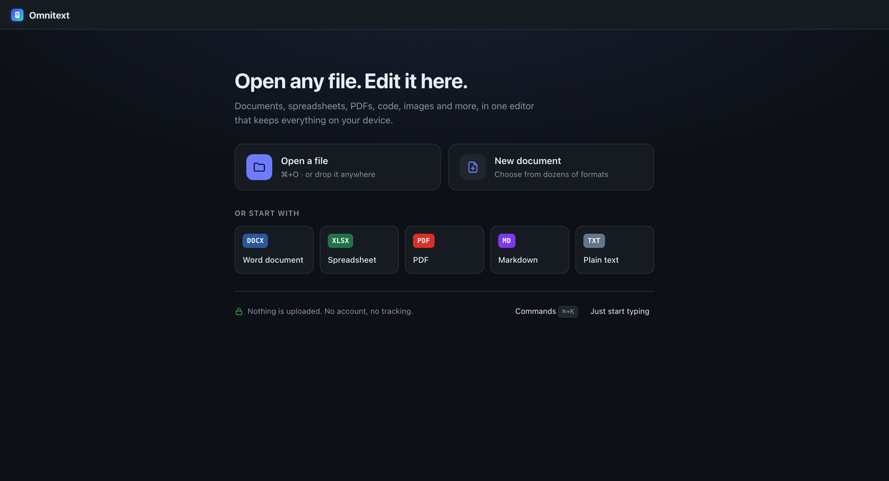
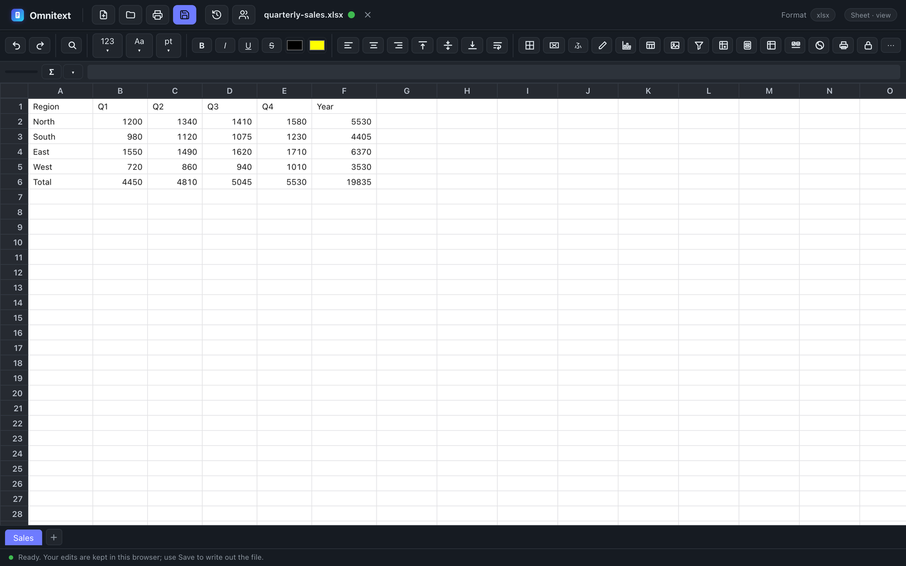
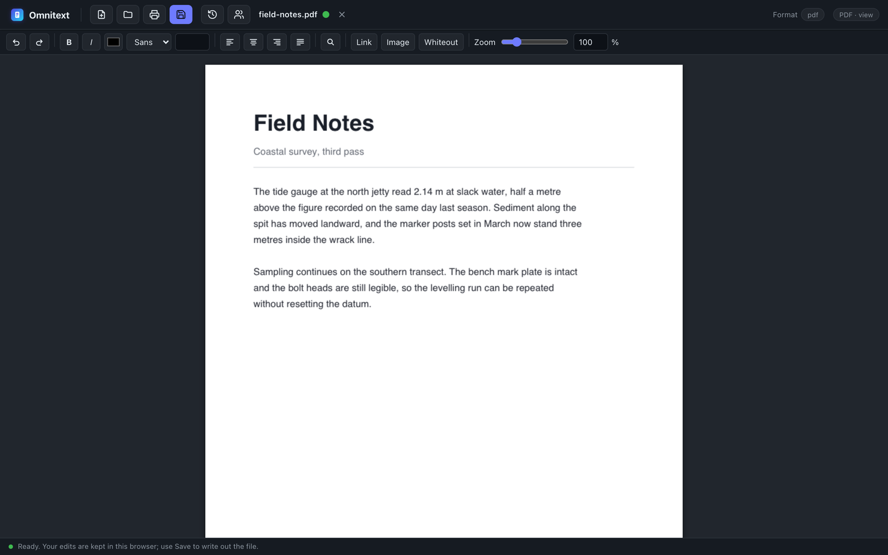
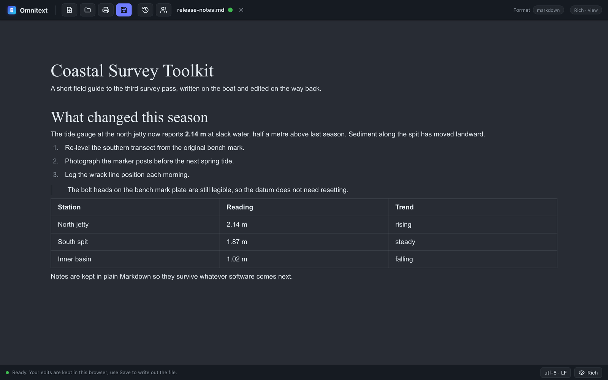
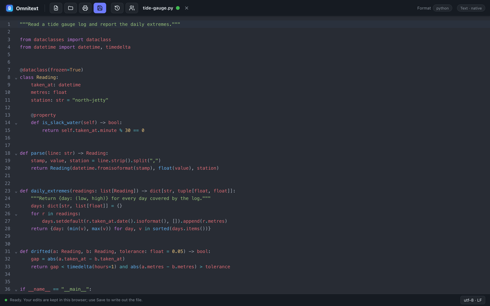

# Omnitext

**One free app that opens and edits practically any file, entirely in your browser.**

Documents, spreadsheets, PDFs, code, images, maps, books, audio and video, archives: Omnitext
picks the right editing surface for each file, lets you edit it, and saves it back. Nothing is
uploaded, there is no account, and no file ever fails to open.

**[▶ Open Omnitext](https://hikashop-nicolas.github.io/omnitext/)** &nbsp;·&nbsp;
[Every format it opens](https://hikashop-nicolas.github.io/omnitext/formats.html) &nbsp;·&nbsp;
[Google Play](https://play.google.com/store/apps/details?id=app.omnitext) &nbsp;·&nbsp;
[Android APK](https://github.com/hikashop-nicolas/omnitext/releases/download/android-latest/omnitext.apk)

## Why you might like it

- **It opens the file you have.** Instead of one website for PDFs, another for spreadsheets
  and a third for images, one app handles them all, on your desktop and on your phone.
- **Your files stay with you.** There is no server, no account, no tracking and no cookie
  banner. The file is read by your browser and written back by your browser.
- **Free, with everything included.** No trial, no watermark, no paid tier, no ads.
- **It works offline.** Visit it once and it keeps working without a connection. Installed
  from your browser menu, it also joins your computer's "Open with" menu.
- **It speaks your language.** English, French, Japanese, Spanish, German, Portuguese,
  Russian and Simplified Chinese, picked automatically.
- **Your edits are kept.** Nothing is saved over your file until you say so, but the work in
  progress survives a crash or a closed tab.

## What it looks like

Spreadsheets keep their formulas, and Omnitext recalculates them as you type:

PDFs are edited in place, so everything you did not touch stays exactly as it was:

Markdown, Word documents and web pages open as rich text, with the raw source one click away:

Code and configuration files get highlighting, folding and live checking, in about seventy
languages:

## What it opens

A short tour. The [format list](https://hikashop-nicolas.github.io/omnitext/formats.html) has
a page for each one, generated from the app itself.

| | |
| --- | --- |
| **Documents** | PDF, Word (DOCX), OpenDocument (ODT), Markdown, HTML, LaTeX, RTF, PowerPoint, EPUB and other ebooks |
| **Spreadsheets and data** | XLSX, ODS, XLSM with working macros, CSV, JSON, SQLite databases, Parquet, Jupyter notebooks |
| **Code and config** | About seventy languages, from JSON, YAML and XML to C, Rust, Go, Python and SQL |
| **Pictures** | PNG, JPEG, GIF, WebP, AVIF, HEIC from an iPhone, camera RAW, TIFF, PSD, SVG (with a full vector editor) |
| **Audio and video** | The usual web formats plus MKV, MOV, AVCHD and more, including Dolby and Apple Lossless audio that browsers normally refuse, with subtitles |
| **Maps** | GeoJSON, KML, KMZ and GPX in an interactive map editor, with measuring and drawing |
| **Subtitles** | SRT, WebVTT, ASS and SSA, with a waveform timeline, transcription and translation |
| **Archives** | ZIP, TAR, 7z, RAR and friends: browse them, open a file inside, or edit and put it back |
| **Everything else** | Unknown text opens as text, unknown binary opens as a hex view. Nothing ever fails to open. |

Files that can be edited are saved back in place: the parts you did not touch keep their
original bytes, down to the encoding and the line endings. A few formats are shown but not
edited (PowerPoint, RTF, ebooks, camera RAW and the other viewers above), and the app says so
instead of pretending.

## Editing together

Share a link and two or more people edit the same file at once, in the same editor, seeing
each other's cursors. There is no server holding the document and no account: the link carries
the room, the browsers connect to each other directly, and the file goes from one machine to
another and nowhere else.

It works in the code editor, the subtitle editor, the spreadsheet, the rich text editor and
the PDF editor. Edits merge rather than overwrite, even inside the same paragraph, the same
cue or the same cell.

Two things are never done on your behalf: refreshing someone else's Power Query, which would
reach the network from your machine, and running someone else's macro. Their definitions
travel; running them is your decision.

## Privacy

Everything runs on your machine. Files never leave the browser, there is no server, no account
and no telemetry. That guarantee is the point of the project.

Collaboration keeps the promise for the document itself: peers connect directly and the file
passes between them. What is not private is the room. Finding each other uses a public relay,
which learns that some browsers are talking, and a session has no identity: names are
self-chosen, so a name says what someone typed, not who they are. Anyone with the link can
join.

## Installing it

- **In a browser**: just [open it](https://hikashop-nicolas.github.io/omnitext/). Your browser
  menu offers to install it, which also registers Omnitext in your desktop's "Open with" menu.
- **On Android**: [Google Play](https://play.google.com/store/apps/details?id=app.omnitext) is
  the easy route. The same app is also available as a
  [direct APK](https://github.com/hikashop-nicolas/omnitext/releases/download/android-latest/omnitext.apk),
  rebuilt from the latest source. Either way it appears in Android's "Open with" chooser, so
  any app can hand it a file.

Settings shows which build you are running, with a *Check for updates* button beside it.
Installed as an app, Omnitext keeps serving the build it has until every window is closed, so
a page never loses a piece it might still need. The button is how you say "now" instead of
waiting.

## For developers

Omnitext is MIT licensed, and so are the standalone editor libraries it is built on, which you
can embed in your own projects, commercial ones included:
[pdfedit](https://github.com/hikashop-nicolas/pdfedit),
[richdoc](https://github.com/hikashop-nicolas/richdoc),
[sheetedit](https://github.com/hikashop-nicolas/sheetedit),
[geoedit](https://github.com/hikashop-nicolas/geoedit),
[subedit](https://github.com/hikashop-nicolas/subedit),
[imageview](https://github.com/hikashop-nicolas/imageview) and
[mediaplay](https://github.com/hikashop-nicolas/mediaplay).

Architecture, the module system, the build and how to add a format or an editor:
**[docs/DEVELOPING.md](docs/DEVELOPING.md)**.

License: MIT.
